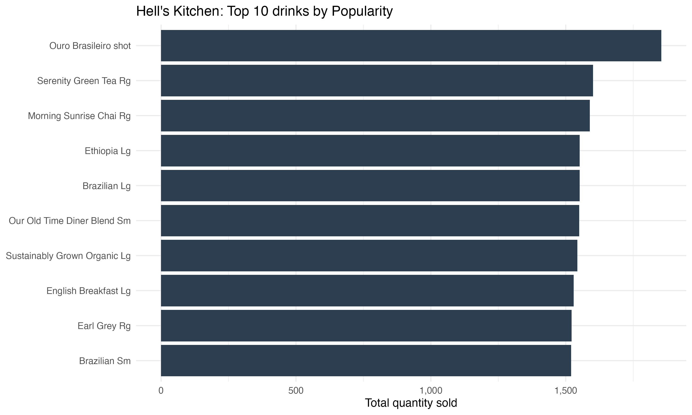

```{r}
knitr::include_graphics("outputs/hells_kitchen_top10_revenue_bar.png")
```

```{r}
tab <- readr::read_csv(
  "outputs/hells_kitchen_top10_revenue_table.csv",
  show_col_types = FALSE
)
```

---

```{r}
knitr::kable(
  tab,
  caption = "Top 10 drinks by total revenue (Hell's Kitchen)",
  digits = 2
)
```

---

```{r}

```

---

```{r}
tab_pop <- readr::read_csv(
  "outputs/hells_kitchen_top10_popularity_table.csv",
  show_col_types = FALSE
)

knitr::kable(
tab_pop,
caption = "Top 10 drinks by total quantity sold (Hell's Kitchen)",
digits = 2
)
```

---

```{r}
cat(readLines("outputs/hells_kitchen_results.txt"), sep = "\n")

```
