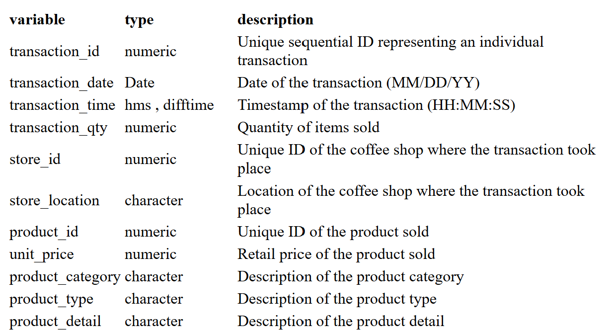
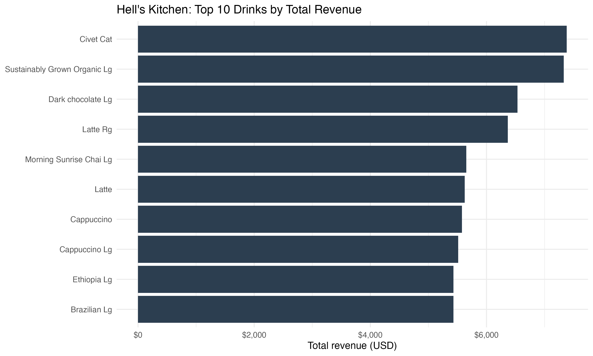

```{r}
library(tidyverse)
library(ggplot2)
library(knitr)
library(lubridate)
library(kableExtra)
coffee_data <- read_csv("Data/coffee-shop-sales.csv")
```

```{r, include=FALSE}
# prep data
coffee_data <- coffee_data %>%
  mutate(transaction_date = dmy(transaction_date))

coffee_sales <- coffee_data %>%
  mutate(sales = transaction_qty * unit_price)

coffee_sales_clean <- coffee_sales %>%
  mutate(month = floor_date(transaction_date, "month"))
```

## Introduction

How can a new café choose a location and initial product offering that maximises early sales and customer engagement?

**Objectives:**

\- identifying the location with the strongest potential for expansion

\- determining which product should be prioritised at launch

Together, these findings will support strategic decision‑making for launching a new café with the highest likelihood of early success.

## Dataset Introduction {.small-slide}

```{r}
#| eval: false
data_dict <- tibble(
  variable = names(coffee_data),
  type = sapply(coffee_data, class),
  description = c("Unique sequential ID representing an individual transaction",
                         "Date of the transaction (MM/DD/YY)", 
                         "Timestamp of the transaction (HH:MM:SS)",
                         "Quantity of items sold",
                         "Unique ID of the coffee shop where the transaction took place",
                         "Location of the coffee shop where the transaction took place",
                         "Unique ID of the product sold",
                         "Retail price of the product sold",
                         "Description of the product category",
                         "Description of the product type",
                         "Description of the product detail"
                         ))
kable(data_dict)
```

```{r}

```

## Store Location Analysis

::: {style="font-size: 0.7em"}
```{r}
coffee_data |> 
  group_by(store_location) |> 
  summarise(sales_quantity = sum(transaction_qty),
            avg_price = round(sum(transaction_qty * unit_price) / sum(transaction_qty), 2),
            total_sales = sum(transaction_qty * unit_price),
            total_transactions = n(),
            avg_transaction_value = round(mean(transaction_qty * unit_price, na.rm = TRUE), 2),
            avg_daily_sales = round(total_sales / n_distinct(transaction_date), 2)) |> 
  arrange(desc(total_sales)) |> 
  kable(col.names = c("Store Location", "Quantity Sold", "Average Price", "Total Sales", "Total Transactions", "Average Transaction Values", "Average Daily Sales")) |>
  kable_styling(full_width = FALSE)
```
:::

## Product Category Analysis

```{r}

coffee_data |> 
  group_by(product_category) |> 
  summarise(sales_quantity = sum(transaction_qty)) |> 
  ggplot(aes(x = reorder(product_category, -sales_quantity), y = sales_quantity, fill = product_category)) +
  geom_col() +
  geom_text(aes(label = sales_quantity), vjust = -0.5, size = 3) +
  scale_fill_brewer(palette = "Paired") +
  scale_y_continuous(labels = scales::comma) +
  labs(x = "Product Category", y = "Quantity Sold") +
  theme(axis.text.x = element_text(angle = 45, hjust = 1),
      legend.position = "none")
```

## Total Sales by Store Location in NYC

```{r, include=FALSE}

# prep data

coffee_sales <- coffee_data %>%
  mutate(sales = transaction_qty * unit_price)

coffee_sales_clean <- coffee_sales %>%
  mutate(month = floor_date(transaction_date, "month"))
```

```{r}
#| output: false
location_summary <- coffee_sales %>%
  group_by(store_location) %>%
  summarise(total_sales = sum(sales),
            total_transactions = n(),
            total_quantity_sold = sum(transaction_qty),
            avg_transaction_value = mean(sales, na.rm = TRUE),
            avg_daily_sales = total_sales / n_distinct(transaction_date)) %>%
  arrange(desc(total_sales)) 
```

```{r}
#| label: fig-location-sales

ggplot(location_summary,
       aes(x = reorder(store_location, total_sales), y = total_sales)) +
  geom_col(fill = "brown") +
  coord_flip(xlim = NULL, ylim = c(220000, 240000)) +
  labs(title = "Total Sales by Store Location in NYC", x = "Store Location", y = "Total Sales") +
  theme_minimal()
```

## Monthly Sales Trends

```{r}
#| label: fig-monthly-sales
monthly_sales <- coffee_sales_clean %>%
  group_by(month, store_location) %>%
  summarise(monthly_sales = sum(sales), .groups = "drop")

ggplot(monthly_sales, aes(x = month, y = monthly_sales, colour = store_location)) +
  geom_line(linewidth = 1) +
  geom_point(size = 2) +
  labs(title = "Monthly Sales Trends by Store Location in NYC",
       x = "Month",
       y = "Monthly Sales ($)") +
  theme_minimal()
```

## Conclusion

This analysis examined the sales performance of Hell's Kitchen, Astoria, and Lower Manhattan, across total sales, transaction behaviour, monthly trends, and hourly patterns.

Taking all findings together, **Hell's Kitchen is recommended as the strongest candidate for a new café**. Its more evenly distributed demand and competitive overall sales provide a more stable and sustainable commercial foundation, which are vital for a new café seeking to establish a consistent customer base from the start.

## Top drinks by revenue

- The revenue in Hell's Kitchen is concentrated in a small set of drinks.
- The highest earners include premium coffees and larger sizes. These are the strongest candidates to feature prominently on the menu.

-----

```{r}
#| out-width: "100%"


```

## Revenue vs Popularity

- Drinks that rank highly in both tables are the best “core menu” items.
- High-revenue but lower-quantity drinks are good “premium/upsell” options.

```{r}

#| out-width: "100%"

tab_rev <- readr::read_csv(
  "outputs/hells_kitchen_top10_revenue_table.csv",
  show_col_types = FALSE
)

tab_pop <- readr::read_csv(
  "outputs/hells_kitchen_top10_popularity_table.csv",
  show_col_types = FALSE
)
```
-----
```{r}
knitr::kable(
  tab_rev, 
  caption = "Top 10 drinks by total revenue (Hell’s Kitchen)", 
  digits = 2
  ) |>
  kableExtra::kable_styling(font_size = 30)
```
-----
```{r}
knitr::kable(
  tab_pop,
  caption = "Top 10 drinks by total quantity sold (Hell’s Kitchen)",
  digits = 2
  ) |>
  kableExtra::kable_styling(font_size = 30)
```

## Results

- Most popular drink: Ouro Brasileiro shot (1,854 units).
- Most lucrative drink: Civet Cat (\$7,380 total revenue).
- Overlap items (popular + lucrative) are safest staples (e.g., Brazilian lg, Ethiopia lg).
- Premium items can drive revenue without top volume (use for upsells).
- Overall menu strategy: prioritise overlap winners + keep a small premium set.
